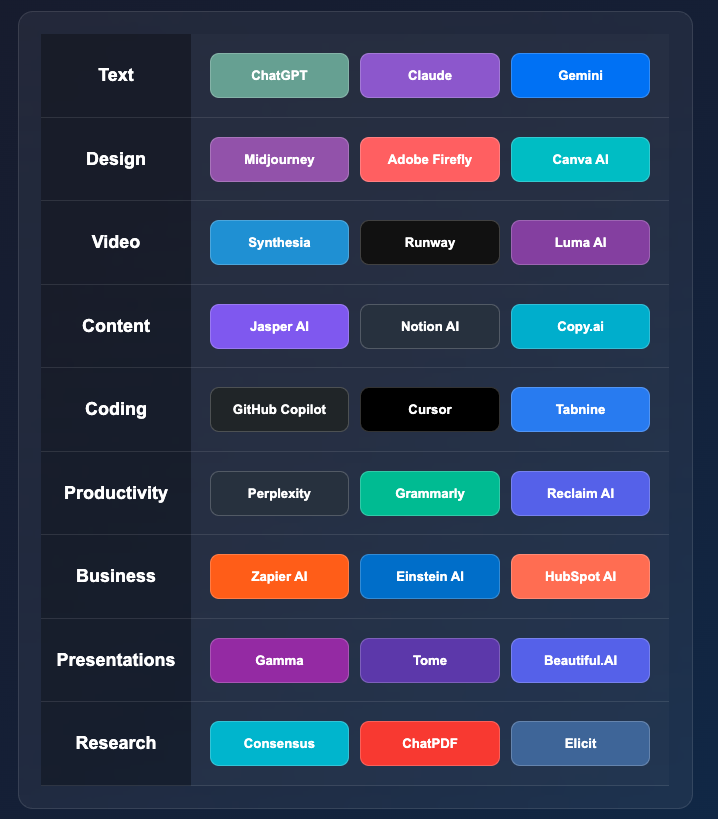

# AI 导航工具 (AI Navigation Tool)



## 项目简介

AI 导航工具是一个现代化的网页应用，为用户提供了一站式的 AI 工具导航服务。该项目收集并分类了当前流行的 AI 工具，让用户可以快速找到并访问各种
AI 服务，涵盖了从文本生成、设计创作到商业应用的多个领域。

## 功能特点

- **分类展示**：将 AI 工具按功能领域分类，包括文本、设计、视频、内容、编程、生产力、商业、演示和研究等类别
- **美观界面**：采用现代化的 UI 设计，深色渐变背景搭配半透明卡片，提供舒适的视觉体验
- **响应式设计**：适配不同屏幕尺寸，在桌面和移动设备上均可良好展示
- **直接访问**：点击任意工具卡片即可在新标签页中打开相应的 AI 工具网站
- **视觉差异化**：每个工具卡片都有独特的背景色，方便用户快速识别不同工具

## 包含的 AI 工具类别

1. **文本 (Text)**
    - ChatGPT
    - Claude
    - Gemini

2. **设计 (Design)**
    - Midjourney
    - Adobe Firefly
    - Canva AI

3. **视频 (Video)**
    - Synthesia
    - Runway
    - Luma AI

4. **内容 (Content)**
    - Jasper AI
    - Notion AI
    - Copy.ai

5. **编程 (Coding)**
    - GitHub Copilot
    - Cursor
    - Tabnine

6. **生产力 (Productivity)**
    - Perplexity
    - Grammarly
    - Reclaim AI

7. **商业 (Business)**
    - Zapier AI
    - Einstein AI
    - HubSpot AI

8. **演示 (Presentations)**
    - Gamma
    - Tome
    - Beautiful.AI

9. **研究 (Research)**
    - Consensus
    - ChatPDF
    - Elicit

## 技术栈

- HTML5
- CSS3 (使用 Flexbox 和 Grid 布局)
- JavaScript (原生 JS)
- 响应式设计

## 安装与使用

### 本地运行

1. 克隆仓库到本地：
   ```bash
   git clone https://github.com/wangjianqi/ai.git
   cd ai
   ```

2. 使用任意 HTTP 服务器启动项目，例如：
   ```bash
   # 使用 Python 的内置 HTTP 服务器
   python -m http.server 8000
   # 或使用 Node.js 的 http-server
   npx http-server
   ```

3. 在浏览器中访问 `http://localhost:8000` 即可查看项目

### 在线部署

1. 将项目部署到任意静态网站托管服务，如 GitHub Pages、Netlify、Vercel 等
2. 配置域名（可选）
3. 访问部署后的网址即可使用
4. [打开](https://wangjianqi.github.io/ai/)

## 自定义与扩展

### 添加新工具

1. 在 `index.html` 文件中找到相应的类别部分
2. 按照现有格式添加新的工具卡片：
   ```html
   <div class="tool-card your-tool-class" onclick="openTool('https://your-tool-url.com')">
       <div class="tool-name">Your Tool Name</div>
   </div>
   ```
3. 在 CSS 样式部分添加新工具的背景色：
   ```css
   .your-tool-class {
       background: #your-color-code;
   }
   ```

### 添加新类别

1. 在 `index.html` 文件中按照现有格式添加新的类别和工具行：
   ```html
   <!-- New Category Row -->
   <div class="category">New Category</div>
   <div class="tools-row">
       <!-- Add tool cards here -->
   </div>
   ```

## 贡献指南

欢迎对本项目进行贡献！您可以通过以下方式参与：

1. 提交 Issue：报告 bug、提出新功能建议或改进意见
2. 提交 Pull Request：修复问题或添加新功能
3. 完善文档：改进 README 或添加更详细的文档

请确保您的代码符合项目的风格和质量标准。

## 许可证

本项目采用 [MIT 许可证](LICENSE)。

## 联系方式

如有任何问题或建议，请通过以下方式联系：

- GitHub Issues: [提交 Issue](https://github.com/wangjianqi/ai/issues)

---

**注意**：本项目仅提供 AI 工具的导航服务，不提供任何 AI 工具本身的功能。所有链接指向的工具由各自的公司或组织提供和维护，请遵循各工具的使用条款和隐私政策。